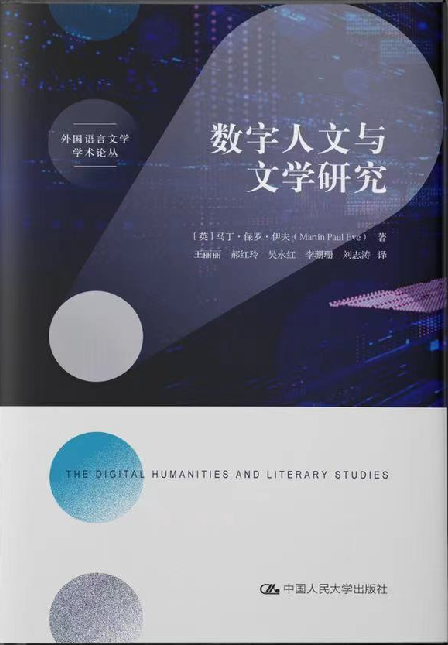
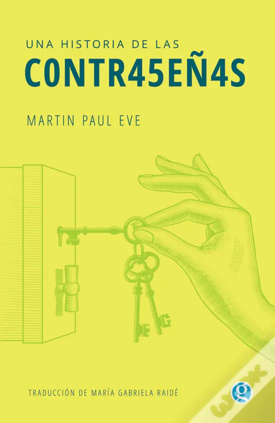

<link href="/books/books.css" rel="stylesheet" type="text/css">

<ul class="collage_images" id="collage_book">

  <li class="image_group"></li>

  <li class="image_group"></li>

  <li class="image_group"></li>

  <li class="image_group"></li>

  <li class="image_group"></li><li class="image_group"></li>

  <li class="image_group"></li>

  <li class="image_group"></li>

  <li class="image_group"></li>

  <li class="image_group"></li>

  <li class="image_group"></li>

  <li class="image_group"></li>

  <li class="image_group"></li>

  <li class="image_group"></li>

  <li class="image_group"></li>

  <li class="image_group"></li>
</ul>

